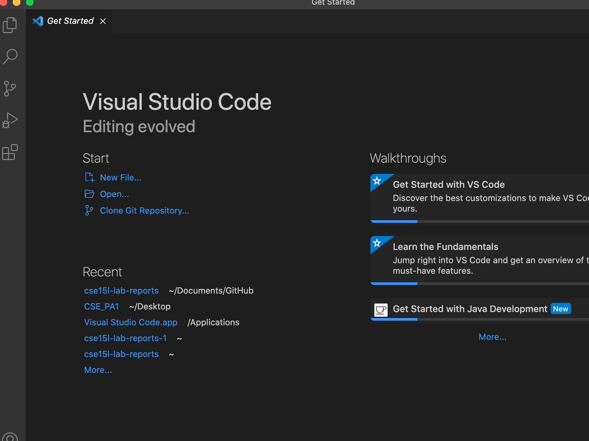
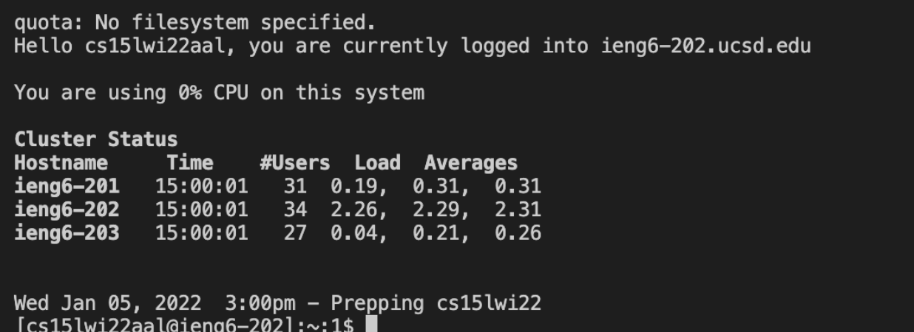
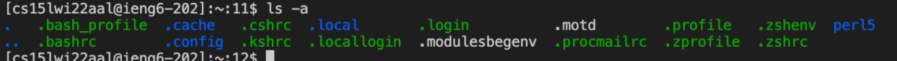
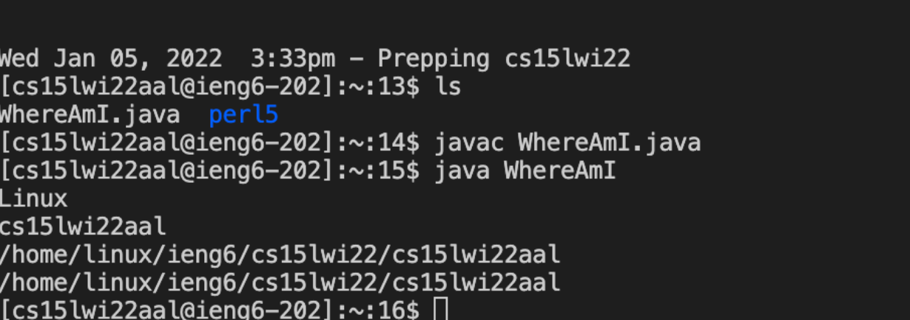
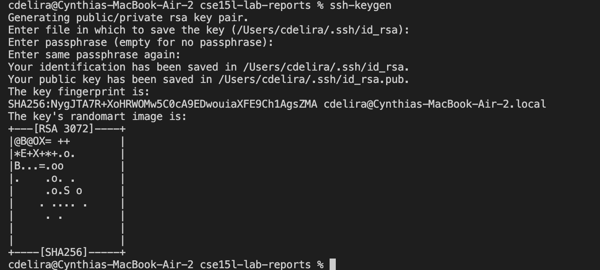
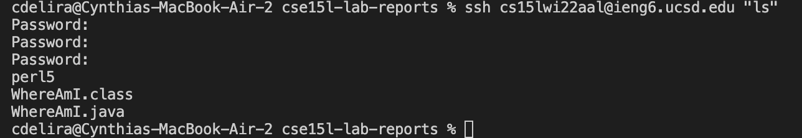

# Week 2 Lab Report: How to Log into course-specific account on ieng6

## Step 1: Installing VSCode
  1. Using this link, https://code.visualstudio.com/ it will direct you to the website where you can download visual studio code.
  2. After downloading it, you can then open VSCode
 
  

## Step 2: Remotely Connecting
  1. Then you will look up your course-specific account using the link:https://sdacs.ucsd.edu/~icc/index.php
  2. Next you will type ssh followed by your account which will connect your terminal to a computer in the CSE basement.

  

## Step 3: Trying Some Commands

  1. Now that your terminal is connected you can try running different commands to see what each does.
  2. As seen in the picture below I ran the command ls -a which lists all files including the hidden ones.

  

## Step 4: Moving Files with scp

  1. To move files with scp you first have to run your file using javac and java on the terminal
  2. Next on the terminal you will type scp followed by name of file.java and then followed by your account and :~/

  

## Step 5: Setting an SSH Key

  1. In the terminal you will now type ssh-keygen then when asked to enter file you will simply hit enter
  2. Next it will ask for a passphrase which you can type anything you'd like just make sure to rember it as it will then ask for it again.

  

## Step 6: Optimizing Remote Running

  1. There are varios ways to make remote running more easier like in the picture below shows an example where writing a command in quotes will help directly running it.

  

  2. Other ways that can make running easier is using semicolons to separate and run different commands at the same time. Also usign the up-arrow can facilitate using the last command in a more efficient way.

