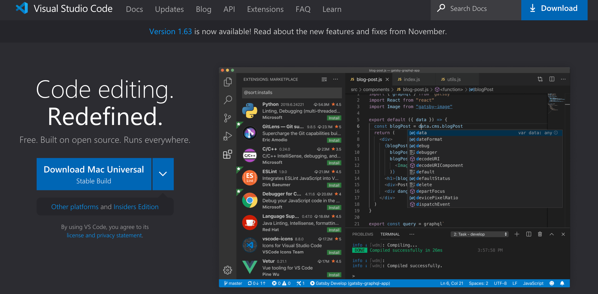
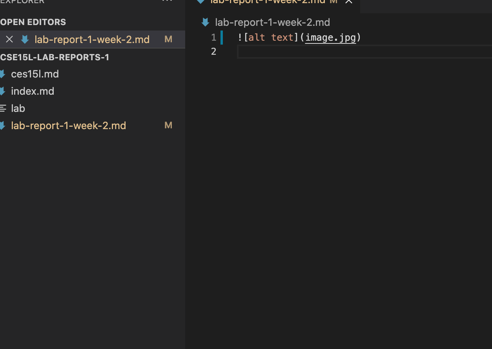

# Week 2 Lab Report: How to Log into course-specific account on ieng6

## Step 1: Installing VSCode
  1. Using this link, https://code.visualstudio.com/ it will direct you to the website where you can download visual studio code.
  2. After downloading it, you can then open VSCode
  

## Step 2: Remotely Connecting
  1. Then you will download GitHub Desktop in order to connect it with VSCode with the following link: https://desktop.github.com/
  2. Next you will open GitHub Desktop and sign in with your account
  3. After you will open VSCode though GitHub Desktop

## Step 3: Trying Some Commands

## Step 4: Moving Files with scp

## Step 5: Setting an SSH Key

## Step 6: Optimizing Remote Running

