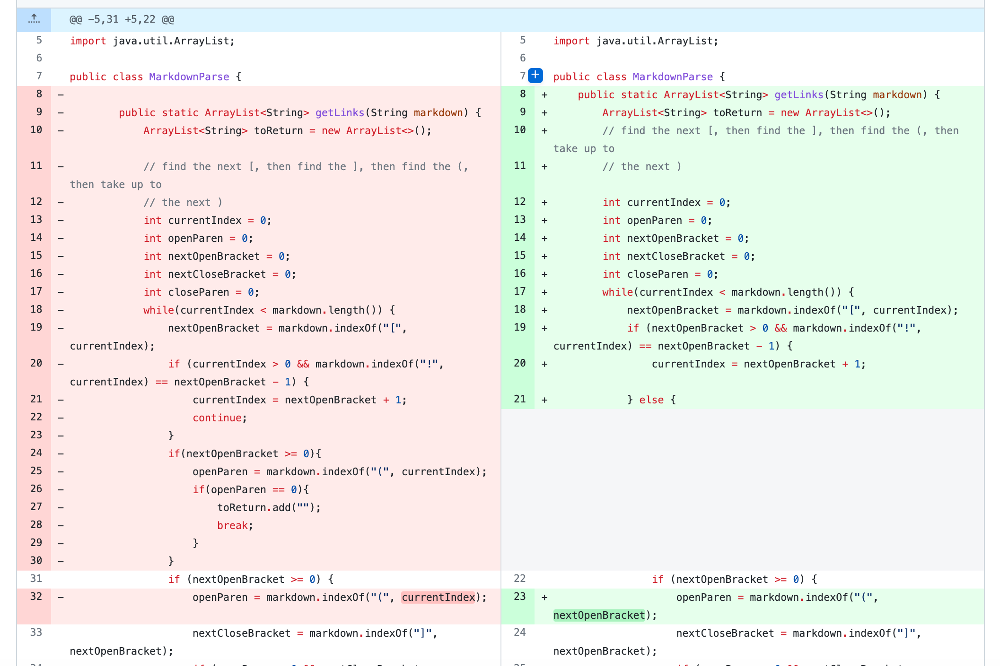
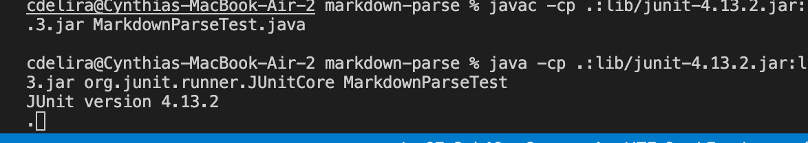

# Week 4 Lab Report

## Change 1

### Screenshot of Code Change

### Link to Test File

[First Test Link](https://github.com/cdelira9/markdown-parse/commit/0436214d13bf573c3b27f3551d9e76db8b3402e0)

### Symptom

### Write-Up

The relationship between the bug, symptom, and input is that they when the code was written and then tested with the written test files it created an error in which nothing was returned and there was a necessary exit from the terminal. This is related to how the code was written since the original code was not written correctly and created a loop instead.

## Change 2

### Screenshot of Code Change

### Link to Test File

[Second Test Link](https://github.com/cdelira9/markdown-parse/commit/759f91d42fc819160b06abd2d5666b4768a59e24)

### Symptom

### Write-Up

The relationship between these is that the failure-inducing input resulted in not passing but instead the terminal was left blank causing me to have to suspend the file from running. This is related to the code written since it was not correctly written and was causing the input to have a failure and was not able to run properly.

## Change 3

### Screenshot of Code Change

### Link to Test File

[Third Test Link](https://github.com/cdelira9/markdown-parse/commit/b2ff5e2db692d09007f8f4c5a7402e7b696dd167)

### Symptom

### Write-Up

The relationship between these three topics was that the failure-inucing input resulted in a forever loop where it continued to print the numbers 73 and 41 non stop that the program had to be suspended manually. This is related to the code since it was creating a forever loop due to the while loop that was written so now knowing the problem we were able to go back to fix it.

