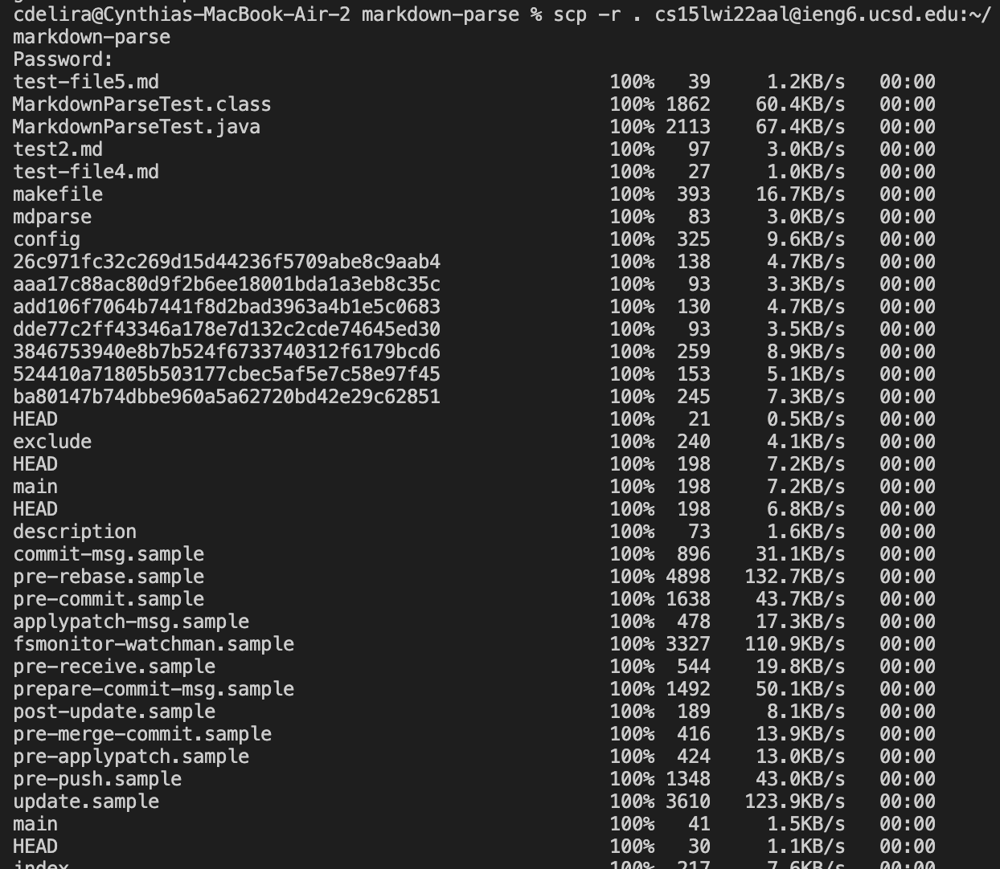
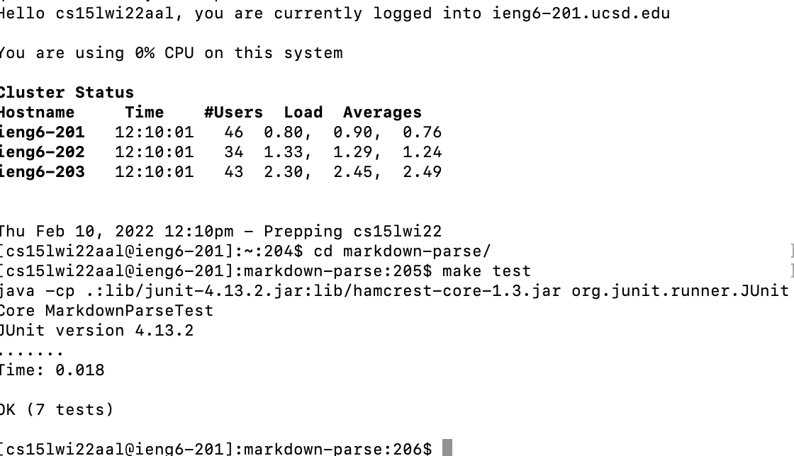
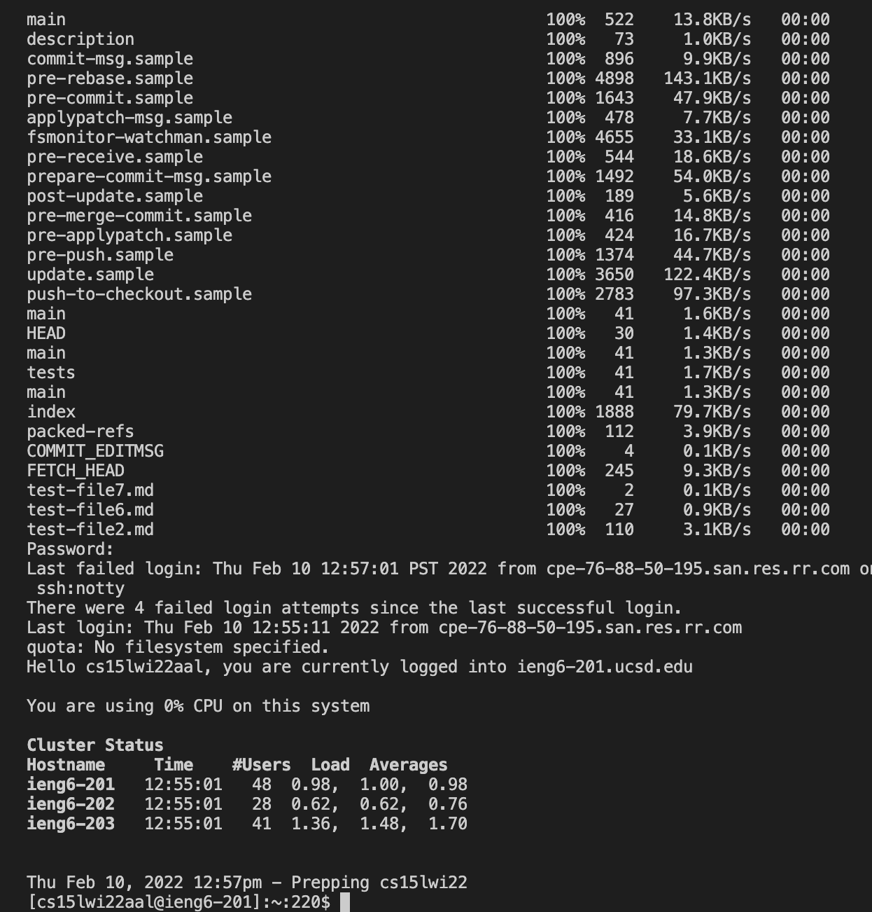

# Lab Report Week 6: Copy whole directories with scp -r

## Markdown-Parse Directory

Using the scp command, I was able to copy the mardown parse directory onto my ieng6 account. The picture
above shows an example on how it logs onto the ieng6 aaccount since it asks for the password and then proceeds to
go through each file and make a copy of it onto the account.

## Ieng6 Account

After copying the markdown parse directory onto my ieng6 account
I was able to log into my account and as shown on the picture above I was able to run and compile the tests from the directory without
any problem.

## scp; ssh

The picture above shows a demonsteration on how it is useful to use both scp and ssh commands on the same line using the semicolon. By running both commands on the same line, it is able to save time typing both commands on two different lines since it copies the files onto the ieng6 account and then logs onto that account right after.