# Week 8 Lab Report

## Link to My Markdown-Parse Repository
[My Markdown-Parse](https://github.com/cdelira9/markdown-parse)

## Link to Markdown-Parse Repository Reviewed
[Markdown-Parse Reviewed](https://github.com/Obarquinho/markdown-parse)

## Test 1

1. VS Code Preview
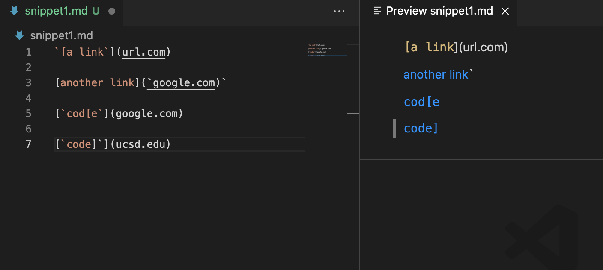

2. Tests
My MarkdownParse
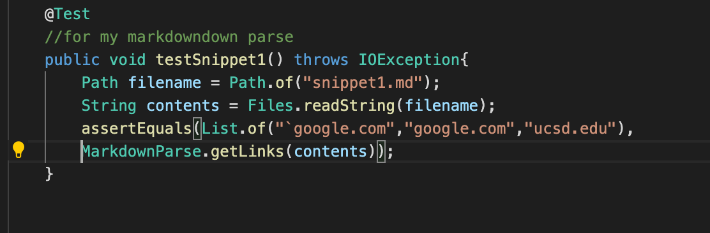

Reviewd MarkdownParse
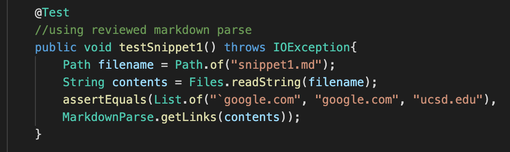

3. Results: 
My MarkdownParse: Tests did not pass
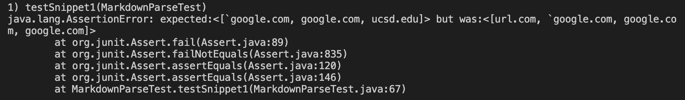

Reviewed MarkdownParse: Tests did not pass
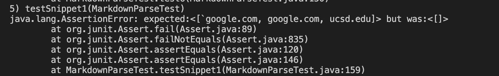

## Test 2
1. VS Code Preview
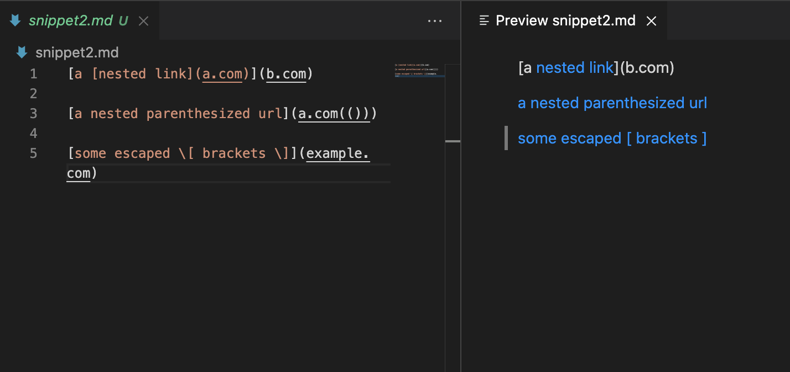

2. Tests
My MarkdownParse
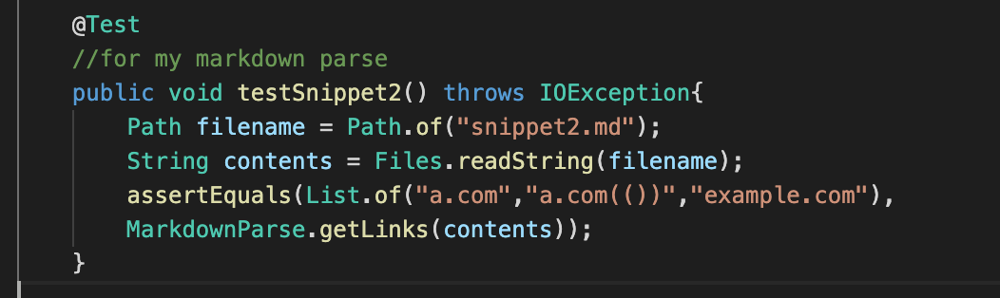

Reviewd MarkdownParse
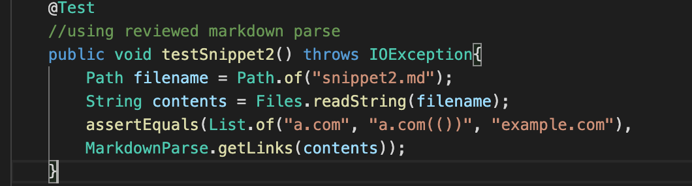

3. Results: 
My MarkdownParse: Tests did not pass
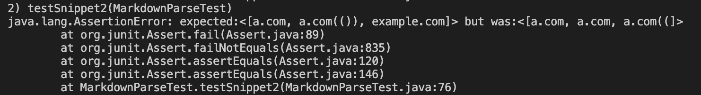

Reviewed MarkdownParse: Tests did not pass
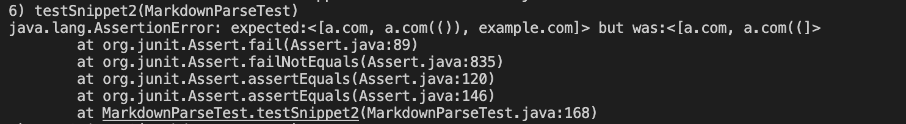

## Test 3
1. VS Code Preview
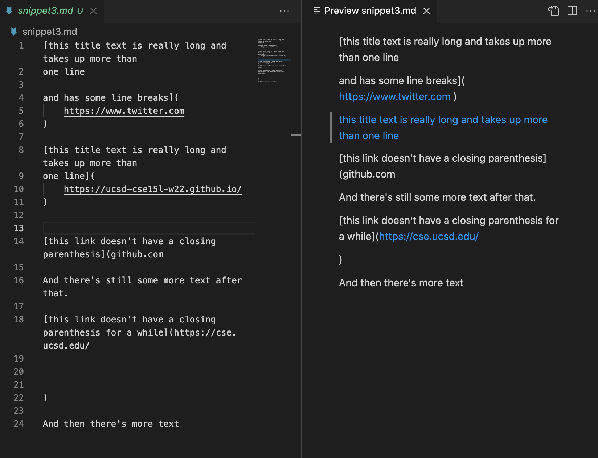

2. Tests
My MarkdownParse
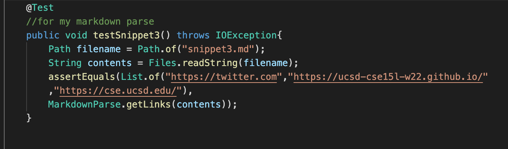

Reviewd MarkdownParse
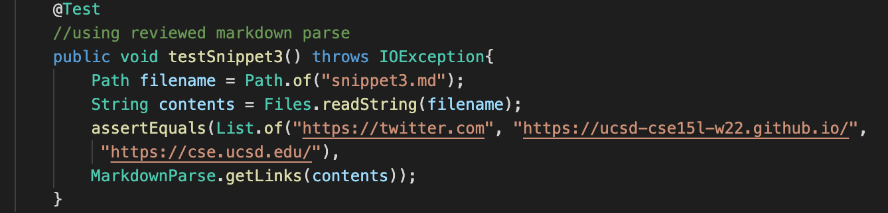

3. Results: 
My MarkdownParse: Tests did not pass
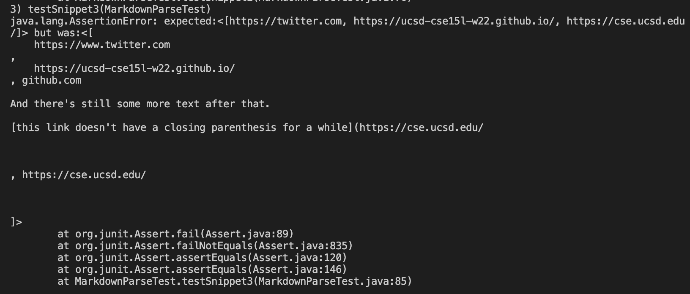

Reviewed MarkdownParse: Tests did not pass

## Write-Up

1. Do you think there is a small (<10 lines) code change that will make your program work for snippet 1 and all related cases that use inline code with backticks? If yes, describe the code change. If not, describe why it would be a more involved change.

2. Do you think there is a small (<10 lines) code change that will make your program work for snippet 2 and all related cases that nest parentheses, brackets, and escaped brackets? If yes, describe the code change. If not, describe why it would be a more involved change.

3. Do you think there is a small (<10 lines) code change that will make your program work for snippet 3 and all related cases that have newlines in brackets and parentheses? If yes, describe the code change. If not, describe why it would be a more involved change.

