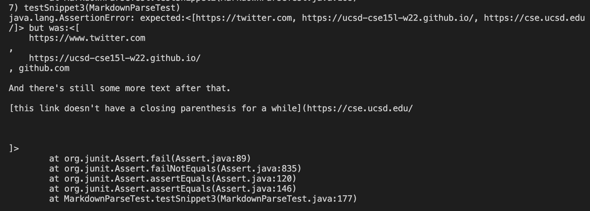

# Week 8 Lab Report

## Link to My Markdown-Parse Repository
[My Markdown-Parse](https://github.com/cdelira9/markdown-parse)

## Link to Markdown-Parse Repository Reviewed
[Markdown-Parse Reviewed](https://github.com/Obarquinho/markdown-parse)

## Test 1

1. VS Code Preview

2. Tests

My MarkdownParse

Reviewd MarkdownParse

3. Results: 
My MarkdownParse: Tests did not pass

Reviewed MarkdownParse: Tests did not pass

## Test 2
1. VS Code Preview

2. Tests

My MarkdownParse

Reviewd MarkdownParse

3. Results: 
My MarkdownParse: Tests did not pass

Reviewed MarkdownParse: Tests did not pass

## Test 3
1. VS Code Preview

2. Tests

My MarkdownParse

Reviewd MarkdownParse

3. Results: 
My MarkdownParse: Tests did not pass

Reviewed MarkdownParse: Tests did not pass

## Write-Up

1. Do you think there is a small (<10 lines) code change that will make your program work for snippet 1 and all related cases that use inline code with backticks? If yes, describe the code change. If not, describe why it would be a more involved change.

I think it is possible to have a small code change for this case since we can implement the code to look for backticks and check if there are any solo backticks before the first open bracket that way we do not count the open brakcet. We have to make sure that we only search for backticks before the first bracket since backticks should not create an error in the open and closed parentheses.

2. Do you think there is a small (<10 lines) code change that will make your program work for snippet 2 and all related cases that nest parentheses, brackets, and escaped brackets? If yes, describe the code change. If not, describe why it would be a more involved change.

For this case, I think it is also possible to fix this error in a small code change since we can implement to accept anything in the first open parentheses to the last closed parenthese while ignoring any other nested parentheses that may be inside the set of parentheses. The only problem that may be harder to change is if the nested parentheses are not in pairs and is simply an extra closed parentheses. This creates a problem since it may read it as the last parentheses but I think this can be fixed by treating it as another character and checking to see if there is another closed parentheses before determining that the current parentheses is in fact the pair to the open parentheses.

3. Do you think there is a small (<10 lines) code change that will make your program work for snippet 3 and all related cases that have newlines in brackets and parentheses? If yes, describe the code change. If not, describe why it would be a more involved change.

I think this case also can be fixed through a small code change since we can implement the code to keep searching in additional lines for that closing parentheses and ignore any additonal and unncessary space that may between the space and closing parentheses.

